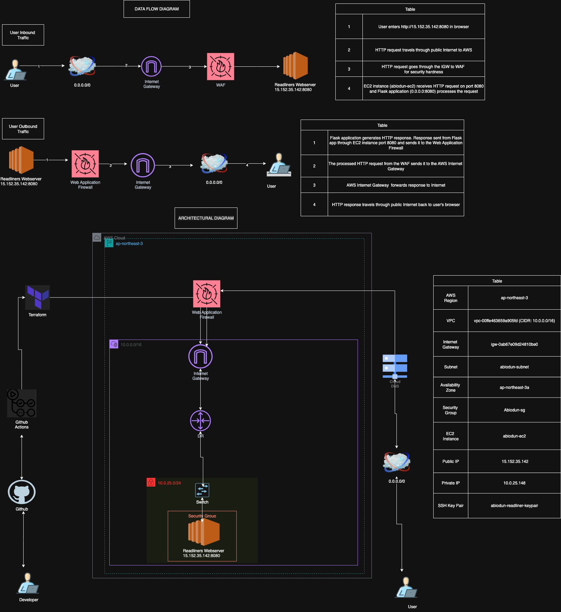
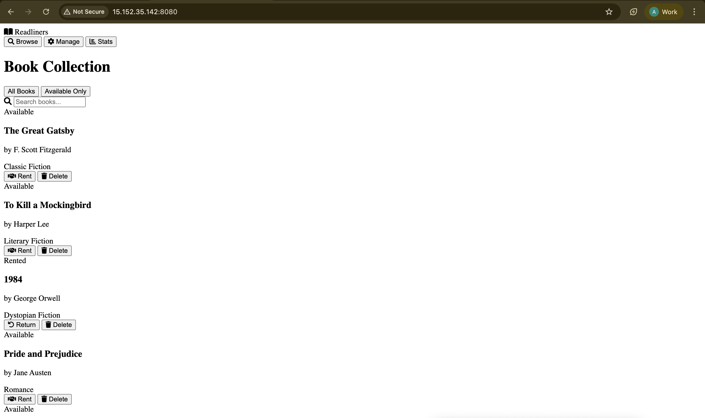
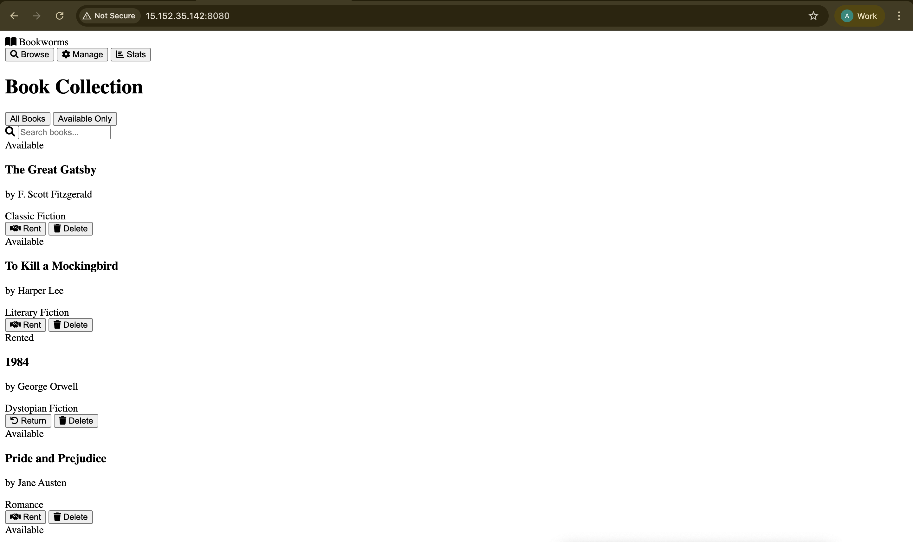
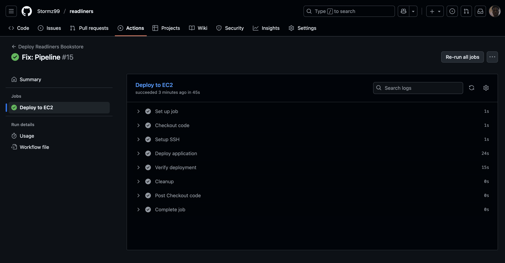
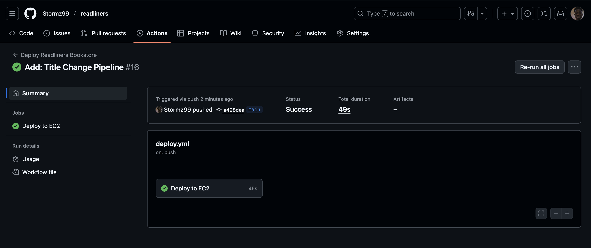

# Readliners Bookstore

A modern Flask-based bookstore application with complete CRUD functionality, deployed using Terraform infrastructure as code and GitHub Actions CI/CD pipeline.


## Features

**Book Management**: Complete CRUD operations for book inventory
**Modern UI**: Responsive design with beautiful animations
**Infrastructure as Code**: Terraform modules for AWS deployment
**CI/CD Pipeline**: Automated deployment with GitHub Actions
**Security**: Best practices with proper access controls
**Analytics**: Real-time bookstore statistics
**Testing**: Unit tests included

## Architecture

<p align="center">
  <a href="images/readliner.drawio.png">
    
  </a>
</p>


## Project Structure

```
readliners-bookstore/
├── README.md
├── .gitignore
├── app/
│   ├── app.py
│   ├── requirements.txt
│   ├── templates/
│   │   └── index.html
│   ├── static/
│   │   └── style.css
│   └── tests/
│       └── test_app.py
├── terraform/
│   ├── main.tf
│   ├── variables.tf
│   ├── outputs.tf
│   ├── terraform.tfvars.readliners
│   └── modules/
│       └── ec2/
│           ├── main.tf
│           ├── variables.tf
│           └── outputs.tf
├── .github/
│   └── workflows/
│       └── deploy.yml
├── scripts/
│   ├── setup.sh
│   └── deploy.sh
└── systemd/
    └── readliners.service
```

## Quick Start

### Prerequisites
- AWS CLI configured with appropriate credentials
- Terraform >= 1.0 installed
- Python 3.9+ (for local development)
- Git
- SSH key pair for EC2 access

### 1. Clone and Setup
```bash
git clone https://github.com/your-username/readliners-bookstore.git
cd readliners-bookstore
```

### 2. Configure Terraform
```bash
cd terraform
cp terraform.tfvars.example terraform.tfvars
# Edit terraform.tfvars with your AWS details
```

### 3. Deploy Infrastructure
```bash
terraform init
terraform plan -var="key_name=your-key-pair-name"
terraform apply -var="key_name=your-key-pair-name"
```

### 4. Configure GitHub Secrets
Add these secrets to your GitHub repository settings:
- `AWS_ACCESS_KEY_ID`: Your AWS access key
- `AWS_SECRET_ACCESS_KEY`: Your AWS secret access key
- `EC2_SSH_KEY`: Content of your EC2 private key
- `EC2_HOSTNAME`: Public IP of your EC2 instance (from Terraform output)

### 5. Deploy Application
Push your code to the main branch to trigger the CI/CD pipeline:
```bash
git add .
git commit -m "Initial deployment"
git push origin main
```

## Lab Configuration (Qucoon)

This project is configured for the Qucoon lab with the following specifications:

- **Region**: ap-northeast-3 (Asia Pacific - Osaka)
- **VPC**: vpc-00ffe463659a905fd (10.0.0.0/16)
- **Internet Gateway**: igw-0ab67e09d24810be0
- **Subnet**: Abiodun-subnet (10.0.25.0/24)
- **Instance**: abiodun-ec2 (Ubuntu t3.micro)

## API Documentation

### Base URL
```
http://<ec2-public-ip>:8080/api
```

### Endpoints

#### Books
- `GET /api/books` - Get all books
- `GET /api/books?available=true` - Get available books only
- `POST /api/books` - Add a new book
- `GET /api/books/{id}` - Get specific book
- `PUT /api/books/{id}/rent` - Rent a book
- `PUT /api/books/{id}/return` - Return a book
- `DELETE /api/books/{id}` - Delete a book

#### Statistics
- `GET /api/stats` - Get bookstore statistics

### Example API Usage

#### Add a Book
```bash
curl -X POST http://<server-ip>:8080/api/books \
  -H "Content-Type: application/json" \
  -d '{
    "title": "The Great Gatsby",
    "author": "F. Scott Fitzgerald",
    "isbn": "978-0-7432-7356-5",
    "genre": "Classic Fiction",
    "description": "A timeless American classic"
  }'
```

#### Rent a Book
```bash
curl -X PUT http://<server-ip>:8080/api/books/1/rent \
  -H "Content-Type: application/json" \
  -d '{"rented_by": "John Doe"}'
```

## Local Development

### Run Locally
```bash
cd app
pip install -r requirements.txt
python app.py
```

### Run Tests
```bash
cd app
python -m pytest tests/
```

## Infrastructure Details

### AWS Resources Created
- **Subnet**: Custom subnet in existing VPC
- **Security Group**: HTTP (8080) and SSH (22) access
- **Route Table**: Public routing to Internet Gateway
- **EC2 Instance**: Ubuntu t3.micro with auto-assigned public IP

### Terraform Modules
- **EC2 Module**: Reusable EC2 instance configuration
- **Variables**: Centralized configuration management
- **Outputs**: Important resource information

## CI/CD Pipeline

The GitHub Actions workflow automatically:
1. **Tests**: Runs unit tests on every push
2. **Builds**: Validates the application
3. **Deploys**: Updates the EC2 instance with latest code
4. **Services**: Restarts the systemd service

### Pipeline Triggers
- Push to `main` branch
- Pull requests to `main` branch

## Security Features

-  EC2 Security Group with minimal required ports
-  SSH key-based authentication
-  Secrets management via GitHub Secrets
-  No hardcoded credentials in code
-  UFW firewall configuration
- Production-ready systemd service

## Monitoring & Logs

### Application Logs
```bash
# View application logs
sudo journalctl -u readliners -f

# Check service status
sudo systemctl status readliners
```

### System Monitoring
```bash
# Monitor system resources
htop

# Check disk usage
df -h
```

## Troubleshooting

### Common Issues

#### Application Not Starting
```bash
sudo systemctl status readliners
sudo journalctl -u readliners -f
```

#### Port Not Accessible
```bash
sudo ufw status
sudo netstat -tlnp | grep 8080
```

#### GitHub Actions Failing
- Check repository secrets are correctly set
- Verify EC2 instance is running
- Check SSH connectivity

### Health Checks
```bash
# Test application locally
curl http://localhost:8080/api/books

# Test from external
curl http://<public-ip>:8080/api/books
```

## Documentation

- [API Documentation](docs/api.md)
- [Infrastructure Guide](docs/infrastructure.md)
- [Deployment Guide](docs/deployment.md)

## Contributing

1. Fork the repository
2. Create a feature branch (`git checkout -b feature/amazing-feature`)
3. Commit your changes (`git commit -m 'Add amazing feature'`)
4. Push to the branch (`git push origin feature/amazing-feature`)
5. Open a Pull Request

## License

This project is licensed under the MIT License - see the [LICENSE](LICENSE) file for details.

---

**Access the application**: `http://<your-ec2-public-ip>:8080`

## Screenshots

<p align="center">
  
</p>

<p align="center">
  
</p>

<p align="center">
  
</p>

<p align="center">
  
</p>
